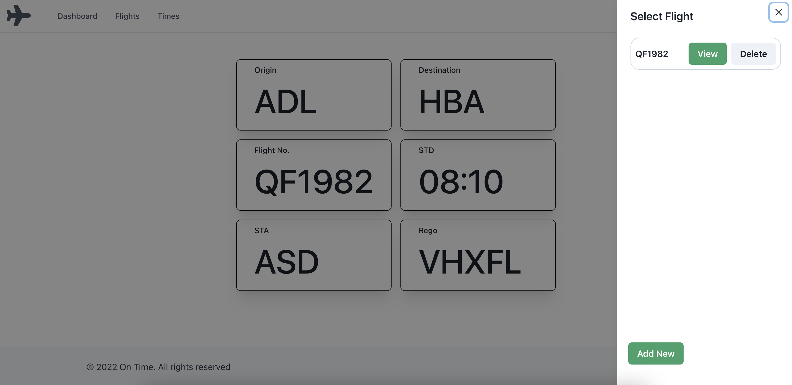

# Final Project

# On Time

## Description 

I work in the aviation industry and everything is time sensitive, we have the need to take down times for a majority of our activities.
From the time the plane lands to the time we finish our last tasks, we are required to gather information on waht time of the day this occured. 
Thsi is why I designed On Time, a easy to use mobile (Destop Also) based application.
With User login, history and fully functioning CRUD a user can log in, simply select a previous flight or add a new one, to which they will be entered into a screen with simple navigation to one click wonder. All it takes is one click and the time will be saved.

## Table of contents 

- [Screenshots](#screenshots) 
- [Technologies](#technologies) 
- [Installation](#installation)
- [Resources](#resources) 
- [Contact](#contact)
  
## Screenshots 
---

*Homepage*

*Login*

*Signup*

*Dashboard*

*Flights*

## Technologies
***
A list of technologies used within the project:

- Javascript
- GIT
- REACT
- HTML
- CSS
- Chakra UI 
- MongoDb
- Mongoose
- Heroku for deploment

## Installation
In the project directory, you can run:

### `npm start`

Runs the app in the development mode.\
Open [http://localhost:3000](http://localhost:3000) to view it in your browser.

The page will reload when you make changes.\
You may also see any lint errors in the console.

### `npm run build`

Builds the app for production to the `build` folder.\
It correctly bundles React in production mode and optimizes the build for the best performance.

The build is minified and the filenames include the hashes.\
Your app is ready to be deployed!

See the section about [deployment](https://facebook.github.io/create-react-app/docs/deployment) for more information.

## Resources

[Github Repo](https://github.com/mckayjalex/project-unknown)

[Live Site](https://unknownontime.herokuapp.com/)

## Contact

GitHub: [GitHub](https://github.com/mckayjalex) Email: [alexjosephmckay@gmail.com](alexjosephmckay@gmail.com)
